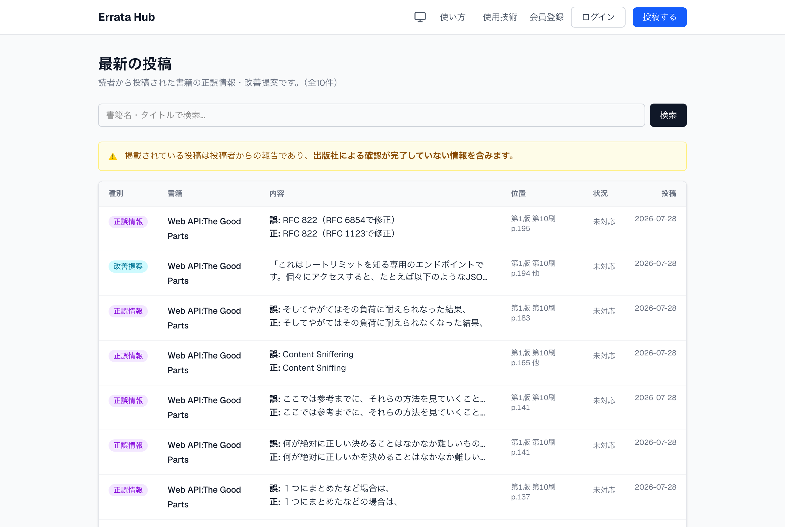

# Errata Hub

[](https://github.com/nkn-ms/errata-hub/actions/workflows/ci.yml)

**技術書を読んでいて見つけた誤りや「こう書いた方が読みやすい」という気づきを、読者が投稿して共有できる公開サイトです。**

### 🔗 https://errata-hub.vercel.app

投稿には誤りの箇所（ページ・行や版・刷）を添えられ、出版社からの回答・対応状況は管理者が記録して公開します。

> ℹ️ 掲載されている投稿は投稿者からの報告であり、出版社の回答がつくまでは未確認の情報です。各投稿に表示される出版社の回答・対応状況とあわせてご確認ください。



| | |
|---|---|
| **開発体制** | 個人開発（要件・設計・実装・運用・法務文書まで） |
| **期間** | 2026-06 〜 継続中（本番公開・検索インデックス済み） |
| **規模** | コミット 516 / マージ済み PR 190 |
| **テスト** | 単体 331 件（Vitest）/ e2e 186 件（Playwright） |
| **運用** | Vercel 本番稼働 / GitHub Actions で CI / Dependabot / CodeQL |

<sub>※ 数値は 2026-08 時点。</sub>

---

## なぜ作ったか

技術書を読んでいると、公式の正誤表にも載っていない誤りに出くわすことがあります。そうした「誤りを見つけ、指摘した」という記録を、技術者自身のポートフォリオとして残せる場が欲しいというのが動機の一つです。
また、投稿しやすいフォームを用意することで、他の技術者の方も気軽に指摘でき、正誤情報がより多くの人に届く——そんな場になればと考えて作りました。

技術的にも、不特定多数が投稿する公開 UGC（ユーザー生成コンテンツ）を題材に、**認証・認可・データ整合性・セキュリティといった「実運用で効いてくる設計」を自分の手で一通り実装してみたかった**、という狙いもありました。

---

## 主な機能

- **書籍検索つき投稿フォーム** — ISBN 検索（OpenBD）/ タイトル検索（Google Books）。書影は両 API でフォールバック補完。送信前に確認画面を挟む
- **投稿（種別つき）** — 正誤情報・改善提案・その他の 3 種別。ページ/行・版/刷などの位置情報つき・該当箇所の画像添付（5枚まで・Supabase Storage）
- **投稿者による修正** — 出版社へ連絡するまでは本文を編集でき、連絡後は追記だけ（出版社が見た内容を後から書き換えない）。取り下げも可能
- **出版社からの回答** — 出版社アクセス権を持つ担当者が、自社の書籍への投稿に公開ページから直接回答できる。運営者が代理記載した場合は画面に明示
- **賛同（自分も見つけた）** — 同じ誤りを見つけた読者が投稿に賛同できる。賛同数は一覧・詳細に表示
- **公開ページ** — トップ（最新投稿）・全投稿の検索/絞り込み・書籍別一覧・投稿詳細・ユーザー別投稿一覧
- **認証** — Supabase Auth（メール確認・PKCE code フロー）/ GitHub ログイン / パスワード再発行 / 退会（匿名化）
- **管理画面** — 対応状況の更新、出版社マスタ管理、ユーザー/ロール管理、出版社アクセスの付与、操作ログ（監査ログ）
- **ダークモード** — OS の設定に追従＋手動トグル

---

## 技術スタック

| 領域 | 採用技術 |
|------|----------|
| フレームワーク | Next.js 16（App Router）/ React 19 / TypeScript |
| スタイリング | Tailwind CSS v4 / 自作 UI コンポーネント（lucide-react アイコン） |
| 認証 | Supabase Auth（メール確認・PKCE code フロー） |
| データベース | PostgreSQL（Supabase ホスティング） |
| ORM | Prisma v7（`@prisma/adapter-pg`） |
| バリデーション | Zod |
| テーブル UI | TanStack Table |
| 外部 API | OpenBD（日本語書誌・ISBN）/ Google Books（タイトル検索・書影） |
| テスト | Vitest（単体）/ Testing Library / Playwright（e2e） |
| CI | GitHub Actions（lint + typecheck + test + build）/ CodeQL / Dependabot |
| デプロイ | Vercel |

---

## 設計の判断 — 何を選び、何を捨てたか

「不特定多数が投稿する公開 UGC」を題材にしたので、判断の多くは**きれいな正解が無く、何かを差し出す**ものでした。代表的なものを、捨てた側も含めて挙げます。

### CSP を nonce + `strict-dynamic` にし、代償として全ページ動的レンダリングを受け入れた

`script-src` に `'unsafe-inline'` を置かないので、注入されたインラインスクリプトは実行されません。

**捨てたもの: 静的生成と CDN キャッシュ。** 静的に生成した HTML にはリクエストごとの nonce を差し込めず、`strict-dynamic` 下ではスクリプトが全部ブロックされるため、全ルートが動的になります。この変更で静的でなくなったのは 13 ルート（`/terms`・`/how-to-use` など文章だけの低トラフィックページ）で、主要ページは DB を読むので元から動的でした。**`'unsafe-inline'` に緩めれば静的に戻せる＝後戻りできる形の代償**だと確認したうえで XSS 耐性を取っています。

`style-src` だけは `'unsafe-inline'` を許しています（nonce は `<style>` 要素にしか効かず、React の `style` 属性には効かないため）。`script-src` の厳格さを守る方を優先した非対称です。

### レート制限に Redis を足さず、Postgres の固定ウィンドウカウンタを選んだ

サーバーレスでは関数インスタンスが使い捨て＋並走するのでプロセス内メモリでは数えられず、共有ストアが要ります。Upstash Redis がこの用途の定番ですが採りませんでした。

- **管理する秘密情報を増やしたくなかった** — 接続情報が1つ増えるたびに、置き場所・ローテーション・漏洩経路も増える
- **障害時の fail open / fail closed の分岐が発生しない** — DB なら「落ちたらどのみち投稿できない」ので分岐そのものが要らない
- **無料枠は守る側が先に尽きる** — Vercel の invocation 100万に対し Upstash は月50万コマンド

原子性は `INSERT … ON CONFLICT DO UPDATE … RETURNING` の1文で取り、**ローカル実 DB で並列 20 発 → 許可 5・カウント 20（数え落とし 0）を実測**して確認しました。スライディングウィンドウにせず固定ウィンドウにしたのは、目的が「外部コストの青天井を防ぐこと」であって瞬間流量の平滑化ではないからです。

### 更新は Server Actions に統一し、Route Handler は「HTTP 境界が本当に要るもの」だけに限った

内部 UI からの更新に自前 API Route を挟むのは、同一プロセス内で HTTP 往復と JSON 二重シリアライズを増やすだけで、分離の実も速度も得られません。残した Route Handler は 3 本だけです。

**そのぶん穴が開きます。** 画像アップロードを Route Handler にしたのは Server Actions のボディ上限が既定 1MB だからですが（`bodySizeLimit` を緩めると全アクション共通に効いて DDoS 耐性を削る）、**Route Handler には Server Actions の自動 CSRF 対策が効きません**。同じ検査（Origin と Host の一致）を `utils/same-origin.ts` に自前で実装し、別オリジン・Origin 欠落を 403 にすることを e2e で担保しています。

### 認可の信頼境界を1点に決め、他は「補助」と明示した

管理操作の Server Action は実行時に必ず `services/auth.ts` の `requireAdminServerAction` を通し、そこで毎回 DB の最新ロールを確認します。`proxy.ts`（認証チェックのみ）とレイアウトガードは**表示制御と早期リダイレクトのための補助**で、セキュリティを保証していません。

Server Action は直接 POST できる公開エンドポイントであり、レイアウトのガードはキャッシュで古くなりうるため、**「どこか1つでも通れば守られる」ではなく「ここを通らないと何もできない」場所を決める**方が重要でした。

### 退会は物理削除でなく匿名化にした

`auth.users` を削除してログインを不能にし、`Profile` は残して PII だけスクラブ、`Report` は保全して「退会済みユーザー」と表示します。公開 UGC では投稿はコミュニティの資産で、消すと他の読者の文脈まで壊れるためです（匿名化すれば GDPR 消去権の対象からも外れます）。

**管理者向けの「ユーザー削除」機能は作りませんでした。** スパムや規約違反の掃除も同じ退会処理を代行する形にしています。`Report.userId` が Restrict で消せないうえ、目的（ログイン不可・PII 消去）はスクラブだけで達成でき、分岐を作らない方が安全だからです。

### 取り消せない操作と監査ログは1トランザクションで束ねた（ただし「全部包む」はしない）

束ねないと「**削除は成立したのに監査ログの書き込みが失敗して『削除に失敗しました』と返る**」が起きます。半端な状態と嘘の文言という、利用者からは直しようのない組み合わせが構造的に消えます。

**ただし線引きが要ります。** 一般に「ログ」は観測のための best-effort でトランザクションに入れるものではなく、**罠は名前の方**でした（`createAuditLog` は名前がログでも中身は説明義務のある業務記録）。取り返しのつかない操作の唯一の痕跡になるもの（削除・退会・権限変更）は包み、画面で結果が見えて戻せるもの（ステータス更新）は包まず文言の嘘だけ直しています。

外部サービス（Supabase Storage）は束ねられないので、**どちらに倒すかを決める**問題になります。画像削除は DB を先に消して孤児ファイルを残す側に倒しました（逆に倒すと画像が壊れて表示され、利用者に見える分だけ実害が大きい）。

### 出版社の回答を「列」ではなく「テーブル」にした

当初は `Report` の列に持っていましたが、**列のままだと上書き事故が構造的に起きます**。ステータス更新のフォームは保存のたびに列の値を丸ごと送るので、管理者がステータスだけ変えるつもりで押すと、その間に出版社が書いた回答が消えます。行を足すだけの形には上書きが存在しません。

スキーマから旧列を消す変更は **expand-contract で「移す」と「消す」を別のリリースに分け**、間に切り戻せる期間を作りました。

### lint ルールを1つ、測ったうえで採用しなかった

到達しない分岐を潰そうと `@typescript-eslint/no-unnecessary-condition` を一時的に有効化して件数を測ったところ **14 件中、素直に従ってよいのは 1 件だけ**でした。残りは外部境界・Server Action の戻り型・キャストに由来する偽陽性で、**この構成である限り比率は改善しません**。`--max-warnings 0` 運用なので、常設すると抑制コメントが 13 本並んで本物が埋もれます。

代わりに「棚卸しのときに手で回す検査」に位置づけました。**収穫の中身は期待と違っていて**、デッドコード検出としては 1/14 でも「キャストが型に嘘をついている箇所」の検出としては 2/2 で当たっており、実際そのうち 1 件はエラーページ自身が 500 になるバグでした。測り方は [`docs/learnings.md`](docs/learnings.md) に残してあります。

### そのほか

- **RLS は「公開裏口（PostgREST）のロック」として使う** — anon キーで触れる経路を全拒否で塞ぎ、認可はサーバー層に寄せる。RLS でアプリの認可を表現しにいかない
- **ISBN の正規化** — ISBN-10/13 を ISBN-13 に統一して名寄せし、`@unique` で重複登録を防ぐ。公開 URL も `/books/<ISBN-13>` にして、**後から変えられない識別子を自然キー側に寄せた**
- **API キーのサーバーサイド化** — Google Books API キーはクライアントに露出させず、認証必須のエンドポイント経由でのみ使う

設計判断の全量は [`docs/design.md`](docs/design.md) §7、学習メモは [`docs/learnings.md`](docs/learnings.md) にあります。

### ER 図

データモデルの全体像は [`docs/erd.svg`](docs/erd.svg) を参照（Prisma スキーマから自動生成）。

---

## セットアップ

### 必要なもの

- Node.js 24（Active LTS）— `.nvmrc` に固定。nvm 利用時は `nvm use` で切り替わる
- Supabase プロジェクト（PostgreSQL + Auth）
- Google Books API キー

### 手順

```bash
# 1. 依存関係のインストール
npm install

# 2. ローカル Supabase を起動（Docker 必要。Auth+DB+Studio 一式）
supabase start

# 3. ローカル用の環境変数を作成（値は `supabase status` 参照）
cp .env.local.example .env.local
#    NEXT_PUBLIC_SUPABASE_PUBLISHABLE_KEY を supabase status の値に置き換える

# 4. Prisma クライアント生成 & スキーマ反映（.env.local のローカルDBに対して実行）
#    （--generator client で ER 図ジェネレータをスキップ）
npx prisma generate --generator client
npx prisma db push

# 5. 管理者ユーザー＋サンプルデータを投入（冪等。ログイン: admin@local.test / password123）
npx prisma db seed   # `npm run seed:local` でも可

# 6. 開発サーバー起動
npm run dev
```

http://localhost:3000 を開く。ローカル Studio は http://127.0.0.1:54323、受信メール確認は http://127.0.0.1:54324。

### 開発コマンド

| コマンド | 内容 |
|----------|------|
| `npm run dev` | 開発サーバー起動 |
| `npm run build` | Prisma クライアント生成 + 本番ビルド |
| `npm run lint` | ESLint |
| `npm test` | 単体テスト（Vitest・1回実行） |
| `npm run test:watch` | 単体テスト（ウォッチモード） |

型チェックは `npx tsc --noEmit` で実行できます。これら（lint / typecheck / test / build）は push・PR ごとに [GitHub Actions](.github/workflows/ci.yml) でも自動実行されます。

### 環境変数

環境ごとの置き場所:
- **ローカル開発** … `.env.local`（`supabase start` のローカル Supabase 値。テンプレ = `.env.local.example`）
- **本番 / Preview** … Vercel の環境変数（このリポジトリに本番値は置かない）

| 変数名 | 用途 |
|--------|------|
| `DATABASE_URL` | アプリ用の DB 接続（本番はコネクションプーラー経由 / ローカルは直結） |
| `DIRECT_URL` | マイグレーション用の直接接続（Prisma v7 は `prisma.config.ts` で使用） |
| `NEXT_PUBLIC_SUPABASE_URL` | Supabase プロジェクト URL（公開） |
| `NEXT_PUBLIC_SUPABASE_PUBLISHABLE_KEY` | Supabase anon/publishable キー（公開・RLS で保護） |
| `GOOGLE_BOOKS_API_KEY` | Google Books API キー（**サーバーサイドのみ**・公開しない） |
| `SUPABASE_SECRET_KEY` | Supabase secret キー（**サーバー専用**・退会処理の auth.users 削除に使用） |
| `SUPABASE_AUTH_EXTERNAL_GITHUB_CLIENT_ID` / `_SECRET` | GitHub ログイン用 OAuth App の資格情報。ローカル= `.env.local`（`supabase start` が読む）/ 本番= **Supabase ダッシュボード**の Provider 設定（Vercel ではない） |

> `.env*` は `.gitignore` 済み（テンプレの `*.example` のみ追跡）。`NEXT_PUBLIC_` 以外の値は秘密情報として扱い、コミットしないこと。本番値はローカルに置かず Vercel で管理する。`prisma.config.ts` は `.env.local` を優先して読むため、ローカルの CLI 操作（`prisma db push` 等）が誤って本番DBを叩くことはない。

仕組みの全体像（どの環境がどのファイルを読むか・優先順位・チートシート）は **[docs/dev-environment.md](docs/dev-environment.md)** にまとまっている。

---

## 開発ドキュメントの地図

**迷ったらまず [docs/dev-environment.md](docs/dev-environment.md)** — env と環境の地図。冒頭に「⚠️ 忘れてはいけないこと」（本番 DB へのスキーマ反映・config 変更時の再起動・Preview 確認してからマージ 等）を集約している。

| ドキュメント | 内容 |
|---|---|
| [docs/dev-environment.md](docs/dev-environment.md) | **env・環境・運用の要注意事項**。開発で迷ったらここが起点 |
| [docs/design.md](docs/design.md) | 設計方針（将来像と確定済みポリシー） |
| [docs/data-model.md](docs/data-model.md) | データモデルの解説 |
| [docs/erd.svg](docs/erd.svg) | ER 図。⚠️ **スキーマを変えたら `npx prisma generate` を手で回す**（`npm run build` はスキップする） |
| [docs/learnings.md](docs/learnings.md) | 開発中の学習メモ |
| [docs/legal/](docs/legal/) | 利用規約・プライバシーポリシー（ドラフト） |
| [docs/moderation-policy.md](docs/moderation-policy.md) | 投稿モデレーション方針（運用内規） |
| [docs/project-requirements.md](docs/project-requirements.md) | 初期要件メモ（歴史資料。現状とは差異あり） |
| [CLAUDE.md](CLAUDE.md) / [AGENTS.md](AGENTS.md) | AI エージェント開発時のルール（**本番反映の安全ルール**は人間にも適用） |
| [.env.local.example](.env.local.example) ほか `*.example` | 環境変数テンプレート（変数名と取得方法の説明つき） |
| [e2e/](e2e/) ＋ [playwright.config.ts](playwright.config.ts) | e2e テスト。ローカルはシード垢自動・外部 URL 実行の注意はコメント参照 |

---

## ディレクトリ構成

```
src/
├── app/          Next.js ルーティング（ページ・API Route）。合成だけを行い、中身は features から取る
├── features/     関心事ごとのまとまり（下記）
├── components/   フィーチャーに属さない UI（下記）
├── constants/    横断する定数（routes, site, rate-limits など）
├── generated/    Prisma 自動生成（編集不可・gitignore）
├── lib/          外部ライブラリのラッパー（prisma / supabase / utils）
├── services/     横断するロジック・認可（auth, audit, withdrawal, publisher-access）
└── utils/        横断する純粋関数（ISBN 正規化・整形など）
docs/             設計・学習メモ・ER 図
```

### 依存の向き

```
components/ constants/ lib/ services/ utils/   （shared）
                  ↓
              features/
                  ↓
                app/
```

**一方向だけ許す。** shared はどこからでも使える。features は shared だけを読む。app は両方を読む。
逆流とフィーチャー同士の直接参照は `import/no-restricted-paths`（`eslint.config.mjs`）で禁止していて、
違反すると lint が落ちる。**規約は文書ではなく lint で守る** — ディレクトリを切っただけの規約は必ず崩れるため。

### features の中身

```
src/features/report/       投稿・出版社からの回答（34ファイル）
├── components/            画面の部品（admin/ に管理画面専用）
├── actions/               Server Action
├── service.ts             読み取り
├── constants/             ステータス・ラベル・文字数上限
├── types.ts
└── utils/
```

フィーチャーの切り口は**テーブルの数ではなく「独立して存在できるか」**。
出版社からの回答は投稿にしか付かず投稿なしには存在できないので、独立したフィーチャーにせず
`features/report/` に含めている（`Publisher`＝出版社マスタは別）。

⚠️ **バレルファイル（`index.ts` での再 export）は作らない。** 直接 import する。

### components の置き場所（フィーチャーに属さないもの）

```
src/components/
├── ui/         ドメインもルーティングも知らない部品（icons, nav-link, number-field, theme-toggle）
└── layout/     全ページの外側を作るもの（site-shell, site-header, header-nav, footer,
                breadcrumbs, legal-shell, error-content, not-found-content）
```

まだフィーチャーに切り出していないドメイン部品（`book-*`, `publisher-*`, 認証・規約まわり）は
`components/` 直下にある。接頭辞が対象を表す。

新しいファイルの置き場所は、上から順に当てはめて決める。

1. **ひとつの関心事に属する**（投稿・書籍・出版社…）→ `features/<name>/`
2. **全ページの外側を作る**（ヘッダー・フッター・エラー画面・パンくず）→ `components/layout/`
3. **ドメインもルーティングも知らない** → `components/ui/`
4. **複数のフィーチャーが使う関数・定数** → `utils/` `constants/` `services/`

「共通かどうか」では分けない。共通性は使われている箇所の数であって、置き場所で表せる性質ではないため
（`features/report/components/report-fields.tsx` は6箇所から使われる共通部品だが、
投稿を知っているので `components/ui/` には入らない）。

### テストの置き場所と分担

テストは実装の隣に置く（コロケーション・`*.test.ts(x)`）。何をどこで担保するかは分けている。

| 対象 | どこで |
|---|---|
| 純粋関数・Server Action・service | unit（Vitest）で全部書く |
| コンポーネント | **ロジック（分岐・状態）を持つものだけ** unit を書く |
| 見た目・操作・アクセシビリティ | e2e（`e2e/`・Playwright）。表示層を触った PR には `e2e` ラベルを付ける |

カバレッジ率は計測していない。上の分担ではコンポーネントの数値が意図的に低くなるため、
率そのものが誤読を招く数字にしかならない。

---

## よくある質問

### Q. ソースコードが公開されていますが、セキュリティ上の問題はありませんか

**A. 問題ありません。コードが読まれることを前提に設計しているからです。**

拠り所は**ケルクホフスの原則**です。19 世紀の暗号学者ケルクホフスが示したもので、「暗号方式は、その仕組みが敵に知られても、鍵さえ秘密であれば安全でなければならない」という考え方です。裏を返せば、**仕組みを隠すことで成り立っている安全は、隠しきれなくなった時点で消える**ということでもあります。これをソフトウェアに当てはめると「秘密にするのは鍵だけで、コードは公開されても成立させる」になります。

このプロジェクトで実際にしていることは 3 つです。

1. **秘密鍵はコードに書かず、サーバー側の環境変数にだけ置く。** Google Books の API キーと Supabase の secret キーが該当します。`NEXT_PUBLIC_` を付けていないので、ブラウザへ配られるバンドルにも入りません。
2. **ブラウザに配られる値は、漏れて困らないものだけにする。** Supabase の URL と publishable キーは、そもそも公開される前提の値です。ここを守っているのは秘匿ではなく RLS で、匿名キーで触れる経路は全拒否で塞いでいます。
3. **鍵を隠すだけでは足りないので、鍵を使う入口にも認可を置く。** 例えば `/api/books/search` はログイン必須です。鍵が漏れなくても、叩かれ続ければ API の無料枠は溶けるからです。

**逆に、この原則を採ると使えなくなる手もあります。** 「管理画面の URL を推測されにくくしておく」のような、知られていないことに頼った守りは数に入れられません。そのぶん、認可・RLS・CSRF 検査といった実際に効く保護を、抜けなく置く必要があります。

考え方の詳細は [`docs/learnings.md`](docs/learnings.md) に整理しています。

---

## ライセンス

本プロジェクトにはオープンソースライセンスを付与していません。
そのため、著作権法上の権利はすべて作者に帰属します（All rights reserved）。
コードはポートフォリオとしての公開であり、無断での複製・再配布・再利用はご遠慮ください。
